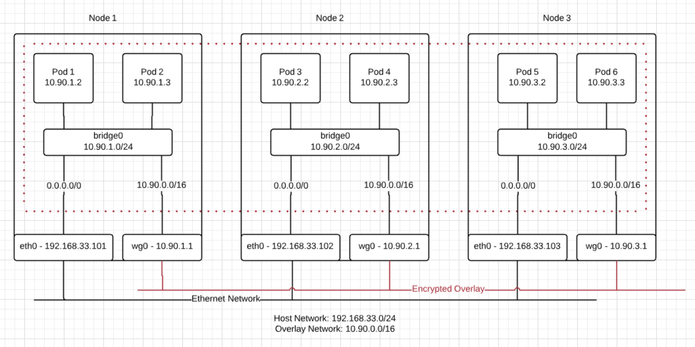

## Feature Name: Wormhole
## Start Date: 2018-10-03
## RFC PR:
## Issue:

# Summary
Wormhole is a new CNI network plugin, to encrypt traffic within a kubernetes cluster, based on WireGuard (https://www.wireguard.com)


This spec is not complete.

# Motivation
Several customers have approached us, asking to support encrypted networking between hosts when running gravity clusters in zero trust networks.

We are looking for a solution that has the following properties:
- Can be totally automated, and is easy to troubleshoot via remote support
- Is simple to turn-on, and will just work for a majority of use cases
- Encrypts all pod-to-pod traffic with minimal configuration

By introducing a CNI plugin based on wireguard, we can create a simple to understand and troubleshoot encrypted overlay network between hosts, that operates transparently to any deployed application.

# Guide-level explanation
This feature allows customers to optionally enable an encrypted overlay network within a [gravity cluster.](https://github.com/gravitational/gravity)

## Non-Goals:

- Multicast / broadcast network traffic will not be supported
- Network policy (use a network policy controller such as kube-router or canal along with this plugin)
- Non-amd64 platforms
- IPv6
- Identity (as in server/client certs)


## Installation

### Gravity
TBD

Note: This still needs to be looked at in greater detail. 

### Non-gravity cluster
```
kubectl apply -f https://raw.githubusercontent.com/gravitational/wormhole/v0.0.0/docs/kube-wormhole.yaml
```
- Note: this will require installation of the wireguard kernel module on the host
- Note: On a kubeadm install, this will require passing --pod-network-cidr=<range> on init to enable the kubernetes IPAM

## Upgrade

### Gravity
- Gravity will upgrade wormhole naturally, as part of it's upgrade process

### Non-Gravity cluster
```
kubectl apply -f https://raw.githubusercontent.com/gravitational/wormhole/v1.0.0/docs/kube-wormhole.yaml
```

## Metrics
A limited set of metrics will be available via a prometheus endpoint.

Metrics:
- Software version
- Traffic counts between each node pair
- Error / Operational Status
- TODO (Packet loss between hosts)

Security:
- The prometheus endpoint should support mTLS client authentication

## Debug

### Logs
Most status / health information will be logged as part of the daemon / pod logs

### Status
Wireguard CLI (wg) will be embedded in the wormhole container, as well as planet, and can be used to inspect the wireguard tunnels easily.

TODO: Wormhole may include it's own status overview

### Docs
Troubleshooting docs similar to other plugins will need to be included

## Health Checks [(Satellite)](https://github.com/gravitational/satellite)
Satellite will monitor the prometheus endpoint and report the following conditions:
- Host-to-host connectivity failures (ping / last handshake time)
- Missing peers (as compared to the k8s API)
- Daemon Errors
- Packet loss / latency

# Reference-level explanation
## Why WireGuard?
Wireguard is a lightweight VPN technology that has been getting many accolades and is currently expected to be mainlined into the Linux kernel. It’s designed to replace IPsec and OpenVPN for most use cases while being more secure, more performant, and easier to use.

The WireGuard paper provides a detailed explanation of the choices and properties offered by wireguard: https://www.wireguard.com/papers/wireguard.pdf

At Gravitational, our experience has consistently shown that simpler is better when operating overlay networks in many different clouds and on-prem environments, and WireGuard is especially appealing as a simple, highly opinionated, and highly performant network encryption solution that will allow us to continue to use the simpler is the better model.

## What about x?
There are a number of fascinating encrypted network plugins already available, that cover various features and capabilities that are not covered by wormhole.

The reason for us to introduce another network plugin, comes down to our experience shows when running clusters in hostile networks, that the simpler we can keep the networking model, the easier it is to troubleshoot in air-gapped, restricted access, networks.

So this plugin is for the use case, where a simple plugin is needed, but also to offer encrypted traffic between hosts.

## Architecture



- Architecture similar to flannel / other plugins
- Uses kubernetes IPAM module for subnet assignments
- Host includes an interface/ip on the overlay network
- Routing
  - Traffic is processed through the routing table on the host network namespace
  - All overlay network is always routed to wireguard interface, prevent leakage
  - Host route table used for external traffic
- Encryption
  - Traffic between pods is naturally encrypted, and will completely fail if not working / not encrypted

## Startup
1. Install CNI plugins (bridge, host-local, etc)
2. Read or Create pre-shared secret in kubernetes API
3. Generate a new wireguard keypair for the local host
4. Configure wireguard 
5. Publish public key to kubernetes API
6. Read local subnet from kubernetes IPAM
7. Configure DNI on the host
8. Setup routing table
9. Configure iptables rules

### Key Distribution
Wormhole uses the kubernetes API to distribute key's to each node, which means ultimately it inherits the security model of kubernetes itself.

WireGuard itself is based on using a key-pair for authentication, similar to ssh key-based authentication. It also optionally employs a pre-shared key for post-quantum resistance.

Notes:
- Generate a new key-pair on every start
  - Key persistance isn't required, simply generate/exchange new key's on each start
- Public keys are published to kubernetes API
  - Use node annotation for publishing keys
  - Effective security of what the kubernetes API guarantees
- Private keys never leave the host, don't need to be persisted
- pre-shared key published as a kubernetes secret (per node pair)
  - kubernetes RBAC restricts which users/processes have access to the keys
  - Last writer wins for conflict resolution
  - Also regenerated on each process start

### Subnet Leases
Subnets will be allocated and maintained by the kubernetes IPAM module.

## Steady State
Wormhole itself will act as a control loop, where it will monitor and sync all configuration:
- Periodically, check iptables for missing rules, and re-create them
- Periodically, list WireGuard peers, and check for discrepancies from kubernetes node list
- Monitor kubernetes objects, and trigger wireguard configuration based on those events

## Network Stack Tuning
This will require some experimentation. Based on the WireGuard docs, it has an interesting property where it does encryption in place, and works with features like segmentation offload. This means we shouldn't need to apply anything like MSS clamping, or interface MTU optimizations, and can potentially support jumbo frames where supported.

Notes:
- Initial tests show the linux internal bridge can be configured with jumbo frames (MTU 65535) without a noticeable impact or benefit to wireguard throughput when leaving the linux host. This will require more thorough testing however.

## Security Considerations
### Anti-Spoofing
Wireguard naturally prevents spoofing of source addresses, by only allowing a peer to send traffic using a whitelisted source IP address. This helps prevent one node in the cluster from impersonating another. By inspecting the peer node object in kubernetes, the whitelist will only be configured to allow traffic for the IPAM range of that node.

However, with most overlay networks, if an adversary is able to spoof the source IP packet and send it to a linux interface, linux will route this as if it came from the overlay network. We’ll need to create a set of iptables rules, that blocks traffic received on unexpected interfaces sourced from the overlay network range.

Optionally, we may need to consider also creating rules to block one pod from spoofing another pod on the same host (on the local bridge).

Note: Initial tests show this shouldn't be an issue in cloud environments, which create internal load balancers. pod-to-pod traffic still uses the internal kubernetes load balancing, even when provisioning an AWS load balancer.

### Network Policy
Network Policy is out of the scope of this guide. The goal here is to be compatible with other plugins that can simply add in a network policy controller on top of wormhole.

### Key compromise (Private Key / Pre-shared)
The loss / re-use of a private key is detectable:
- Re-used private key will be treated as roaming by wireguard. It will break existing connections, and show as a source other than the advertise-ip known for the peer. 
- There is a limited window, where if a node is down/unreachable, and the source-ip can be spoofed for full-duplex communications, that an adversary could communicate within the overlay network.

Rotation of the private and shared keys can easily be triggered, simply by restarting wormhole on the node. Initial testing shows the common case on small clusters is this startup takes less than a second, and the impact can be further reduced by draining the node.

Note: the shared key for a node pair will be available to all participants within a cluster.

### Audit
Kubernetes API audit logs will capture the publishing and changes to the key's used by the cluster.

### Firewall
It is possible to firewall the wireguard port to only accept traffic from other peers, however, this doesn't seem beneficial at this time. WireGuard itself is designed to work passively on a port, and we may in the future want additional capabilities for connecting additional
nodes or clients to the overlay network.

### Kubernetes API/RBAC
wormhole will use the kubelet node certificate to access the cluster, which will restrict manipulation of public key's to only it's own node object. 

For shared secrets and any additional configuration, wormhole will use a service account when running as a pod, or an mTLS certificate when running outside of a pod, using kubernetes RBAC to restrict access to the minimum required objects to function.

## Drawbacks
This would be yet another kubernetes network plugin, in a realm of lots of plugins, that we would need to maintain.

## Rationale and Alternatives
- Flannel appears to have a partially implemented wireguard solution
    - it doesn’t look like there has been any progress since December. 
    - Alternative: try and complete the flannel implementation and publish it.
- Flannel has an ipsec based backend
    - Read the wireguard paper on why wireguard is the future (https://www.wireguard.com/papers/wireguard.pdf)
- Cilium is a very interesting tool that offers lots of capabilities
    - My understanding, is cilium requires a decent amount of integration from the applications / kubernetes objects
    - It’s also a complex tool, using lots of complex interactions, offloads to the kernel.
    - I suspect, will be very difficult to troubleshoot in environments we don’t control (remote support / shared screen / etc).
- Weave
    - Weave uses a userspace router for sending traffic between nodes, which will have a performance penalty. It also has a fast path based on ipsec kernel structures, which can be difficult to troubleshoot.
    - Weave does add interesting capabilities though, such as multicast, but again has a complexity concern when running in environments we don’t control (remote support, shared screen, etc)

## Unresolved Questions
### WireGuard kernel plugin
Specifically for gravity, we need to see if we will be able to package and install the wireguard kernel module automatically along with gravity based installs on supported distributions. This will be difficult, since we support a variety of kernels, and have a design goal of being easy to install on air-gapped environments.

The linux kernel should eventually contain native support, which will make this requirement largely disappear in the future.

## Future Work
Using a wireguard VPN as an overlay network, leaves some very interesting potential future extensions.

Telepresence (https://www.telepresence.io) has gained a lot of recent popularity, by combining local development and troubleshooting, using a novel two-way network proxy and overriding a process to use the proxy for DNS resolution / and TCP connections. Wormhole on the other hand, could allow non-cluster machines, such as development machines, security scanners, non-kubernetes clients, etc to VPN to the overlay network, have an address on the network/ be fully connected to service discovery, etc. 

In reverse, connecting a cluster to non cluster resources also has some potential, such as a bare-metal DB server, where the mesh/overlay network is extended to these machines by installation of an agent, and granted access to the kubernetes API (limited by k8s RBAC). 

And last, this could be a very interesting solution for federation of multiple kubernetes clusters, and phone home connections for logs, metrics, etc. when bridging companies networks.
